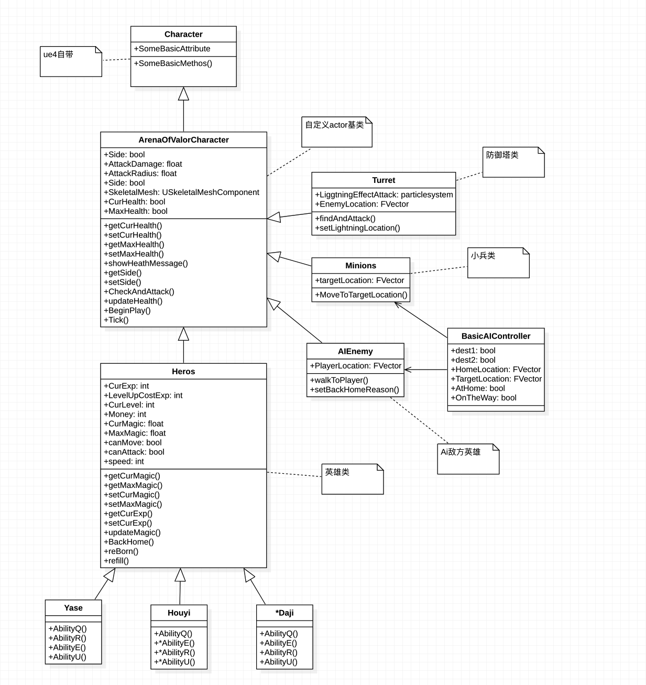

### 项目文档

[toc]

<br>


#### 项目基本信息

##### 项目名

ArenaOfValor

##### 项目成员

王毅诚 王舸飞 周福佳

##### 分数比例

三人等分

##### github地址

https://github.com/enginewang/ArenaOfValor

##### 项目进度时间线（大约时间点）
|    时间    |         进度          |
| ---------- | ---------------------- |
| 2019.04.30 | 添加英雄模型和地图模型 |
|2019.05.02|实现英雄移动跳跃|
|2019.05.08|确定代码架构和设计模式|
|2019.05.12|定义人物基类的基本属性和基本函数|
|2019.05.15|实现主面板显示基本属性|
|2019.05.20|实现攻击逻辑和扣血同步||
|2019.05.23|实现第一个英雄技能|
|2019.05.24|在转移项目到硬盘的过程中保存主项目的电脑崩溃，导致项目不得不重写|
|2019.05.28|项目恢复到损坏之前的状态|
|2019.05.29|实现3D血条widget|
|2019.06.02|实现部分属性的网络同步|
|2019.06.04|实现基本的小兵Ai和敌人Ai|
|2019.06.06|实现防御塔和野怪攻击逻辑|
|2019.06.08|实现部分动画的网络同步|
|2019.06.10|实现攻击反馈、添加商店购买物品|
|2019.06.12|实现另外的几个技能|
|2019.06.14|实现塔被摧毁后的游戏结束逻辑|
|2019.06.16|完成游戏打包|

##### 项目选用引擎

虚幻4 (unreal engine 4.22)


#### 游戏整体架构设计+小组分工

##### 架构图



##### 小组分工

王毅诚：架构、模型搭建、UI、基础AI、游戏逻辑、文档、ppt

王舸飞：游戏逻辑、技能、音效、项目打包、ppt

周福佳：网络搭建、逻辑的网络改进


#### 用到的设计模式


#### 实现的功能点和实现思路


##### C++功能

① STL容器，具体的英雄类中使用STL::Map记录技能耗蓝、获取攻击目标使用STL::Vector储存actor数组

```C++
// Yase.cpp
#include "Yase.h"
#include <map>

// 亚瑟技能耗蓝的map
const map<string, int> YaseAbilityCost = {
        { "Q", 10 },
        { "E", 20 },
        { "R", 30 },
        { "U", 50 }
};
```

② 类和多态：大部分类里都有多态，总共20多次使用到了多态

```C++
// Heros.h
    virtual void BeginPlay() override;

    virtual void Tick(float DeltaTime) override;

    virtual void SetupPlayerInputComponent(class UInputComponent* PlayerInputComponent) override;
```


③ 函数重载：同样用了很多次函数重载，大部分是重载ue自带的常用函数

```C++
// Turret.h
    virtual void Tick(float DeltaTime) override;

    virtual float TakeDamage
        (
            float DamageAmount,
            struct FDamageEvent const & DamageEvent,
            class AController * EventInstigator,
            AActor * DamageCauser
        ) override;
```


④ C++11及以上功能：包括”for ：”语法糖、auto声明变量等

```C++
// ArenaOfValorCharacter.cpp
for (AActor* Actor : ActorsInRadius) {
        auto thisActor = Cast<AArenaOfValorCharacter>(Actor);
        if (thisActor) {
            if (thisActor->MySide == 1 - MySide || thisActor->MySide == NEUTRAL_SIDE) {
            TargetedActors.Push(thisActor);
            PerformAttackDamage(thisActor);
            break;
        }
    }
    UE_LOG(LogTemp, Log, TEXT("%g"), thisActor);
}
```

##### 移动逻辑

调用引擎自带的接口，加上按键绑定可以实现，向前就是MoveForward一个单位，向后就是MoveForward负一个单位，其余同理

```C++
void AArenaOfValorCharacter::SetupPlayerInputComponent(class UInputComponent* PlayerInputComponent)
{
    PlayerInputComponent->BindAction("Jump", IE_Pressed, this, &ACharacter::Jump);
    PlayerInputComponent->BindAxis("MoveForward", this, &AArenaOfValorCharacter::MoveForward);
    PlayerInputComponent->BindAxis("MoveRight", this, &AArenaOfValorCharacter::MoveRight);
}
```

##### 攻击逻辑

有三种攻击逻辑：

第一个是通过攻击范围Sphere组件的碰撞引发攻击
```C++
AttackRangeComp->GetOverlappingActors(ActorsInRadius);
...
TargetedActors.Push(thisActor);
PerformAttackDamage(thisActor);
```

第二种是获取全场actor，通过距离判断、所在边、是否存活来判断目标是否承受伤害
```C++
void AHeros::checkAndAttack(float radius, float damage){
    UGameplayStatics::GetAllActorsOfClass(GetWorld(), AArenaOfValorCharacter::StaticClass(), TargetActors);
    for (AArenaOfValorCharacter* Actor : TargetActors) {
        auto thisActor = Cast<AArenaOfValorCharacter>(Actor);
        if (this->getDistanceTo(thisActor) && thisActor->MySide != MySide && thisActor->isAlive==true) {
                thisActor->CurHealth -= this->AttackDamage;
        }
        ...
    }
}
```

第三种用于一些技能中，通过发射发射物碰撞其他actor产生伤害
```C++
void AHouyi::AbilityQ()
{
    FTransform SpawnTransform = SpawnProjectilePoint->GetComponentTransform();
    ...
    SpawnedProjectile = (AProjectile*)GetWorld()->SpawnActor(Projectile, SpawnTransform);
}
```
```C++
void AProjectile::OnHit(UPrimitiveComponent* HitComp, AActor* OtherActor, UPrimitiveComponent* OtherComp, FVector NormalImpulse, const FHitResult& Hit)
{
   if ((OtherActor != NULL) && (OtherActor != this) && (OtherComp != NULL) && OtherComp->IsSimulatingPhysics())
   {
        AHeros* MyCharacter = Cast<AHeros>(OtherActor);
        MyCharacter->CurHealth-=20;
        Destroy();
    }
}
```

##### 角色产生

英雄、小兵的诞生都使用Gamemode完成，英雄产生思路是获取全场startpoint的位置，在上面spawn指定英雄，小兵是在游戏开始时设置timer，每隔一段时间两边各spawn一波小兵，一波三只，包括一名近战小兵、远程小兵（这两个可能看不太出来，因为逻辑基本一致）、炮车（后面那个大的）


##### 金币、经验、等级系统

都作为Heros里的属性，击杀敌人后有反馈，也有随着时间的缓慢增加，在蓝图中也进行了一些拓展。

##### 简单Ai

小兵的Ai比较简单，诞生之后移动到某个指定位置（对方水晶），中途如果能够触发攻击就会停下来攻击，死亡后播放动画，直接destroy。

单机模式，敌方英雄Ai在小兵Ai的基础上，增加了跟踪玩家的功能和血扣到一定值后回家补血的功能，虽然也比较智障就是了。

##### 备注

其他的一些功能使用了虚幻编辑器的蓝图来实现，因为会调用一些动画或者资源，用C++会面临一些路径问题也会让代码过于复杂，虚幻官方也推荐C++加蓝图的方式构建游戏，我们游戏中的Gamemode、UI、技能、动画触发、AI拓展、网络搭建都是在编辑器中用蓝图中完成的，很多函数的功能也在蓝图中得到了一些拓展，当然编写蓝图的工作量也非常大。

#### 项目中遇到的困难和解决方案和过程

① 原先的attackSphere碰撞普攻逻辑会造成两个人物之间相隔二者的攻击范围之和就会造成伤害扣血，碰撞体的被碰撞组件被默认设为了攻击范围sphere，不知道如何设成攻击sphere碰撞mesh。

解决方案和过程：涉及到此问题的类改用另一种方法，即第一步先获取附近人物列表，再按照side和距离筛选出攻击范围内的敌人，随后对其造成伤害

② 血条不同步，引入网络之后，原先写的血条没有同步。

解决方案和过程：

③ 使用git协同，但是项目总文件过大（>20G），导致push和fetch的时间过长，难以同步

解决方案和过程：github上只上传代码，这样可以做到代码同步，但是代码相关的动画、模型、地图等必须在虚幻编辑器中完成，所以就算代码同步了，打开的项目运行还是会有问题。资源文件使用Git LFS同步后下载速度还是非常慢，后面的时间我们只好成员轮流抽时间在一台能较流畅运行虚幻4上工作，隔一段时间备份项目和上传github。

④ 回车和重生失效，setActorLocation不可用，玩家在按B键回家时位置没有发生变化

解决方案和过程：这个函数一开始有用，在几天之后忽然失效，推测是网络的问题，改变了client端的位置却没有改动server端的位置，因此新建一个服务端函数SetActorLocationEveryWhere()，里面调用ue4接口setActorLocation，然后在客户端同步服务端的位置，就可以实现位置转移

当然中途还有很多其他的问题...有的得到了解决，有的进行了妥协

#### 其他有亮点的部分

① 地图、人物模型、粒子效果、动画、音效、UI...

素材找了很久，模型的质量都是很高的

② 视角采取第三人称视角，与传统moba不同，可以清楚的看到人物模型和细微动画，体验很好。设置摄像头的位置即可：
```C++
CameraBoom = CreateDefaultSubobject<USpringArmComponent>(TEXT("CameraBoom"));
CameraBoom->SetupAttachment(RootComponent);
CameraBoom->TargetArmLength = 300.0f;
FollowCamera = CreateDefaultSubobject<UCameraComponent>(TEXT("FollowCamera"));
FollowCamera->SetupAttachment(CameraBoom, USpringArmComponent::SocketName);
```

③ 3d血条：采用 颜色rgb计算+蒙版遮罩产生3d环形血条，函数传入一个参数代表生命百分比，根据此参数决定环形材料所加的蒙版被遮住的比例，即血量越少，血条长度越短；另一边也是根据此参数，计算材料RGB值，让其从红色和绿色之间简便，即随着血量降低，血条从绿色到红色（因为是材料函数，没法在C++中写）只能写在material窗体的函数中，截图：


#### 还需改进的部分

三位同学都在嘉定校区，除了C++，其余的课程设计大项目还有六七个，时间非常紧张，而且年级不一样寝室楼不同，很难协商出三个人都有空的时间。任务分配时因为难度方面的原因导致一些进度有所耽搁，后面需要用到前面基础的部分只能等待，再加上中途的一次主项目文件损坏，导致原定的计划没有得到很好的执行，主要是时间原因，导致有的地方做的不够完善，之后有时间再回过头来慢慢自行填补。

初始选择英雄界面、装备系统没来得及完成，妲己这个英雄技能没有来得及完成，ai的行为比较简单，其余的基础功能基本还是实现了。
